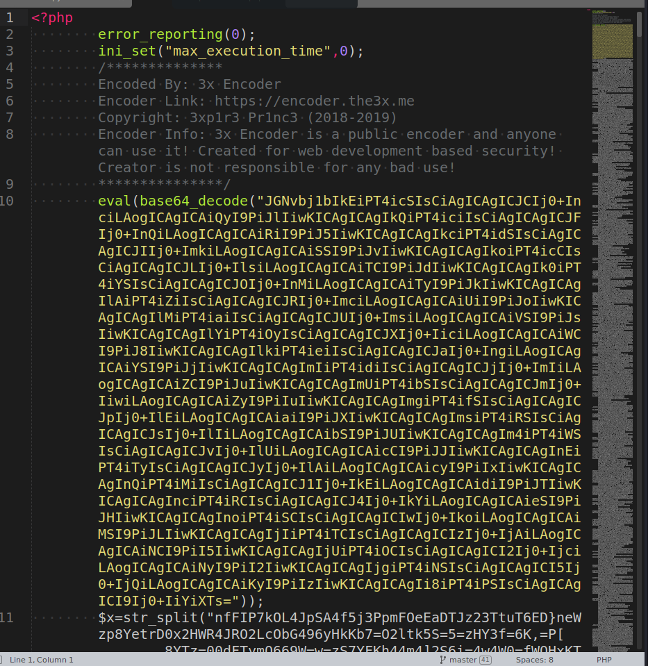
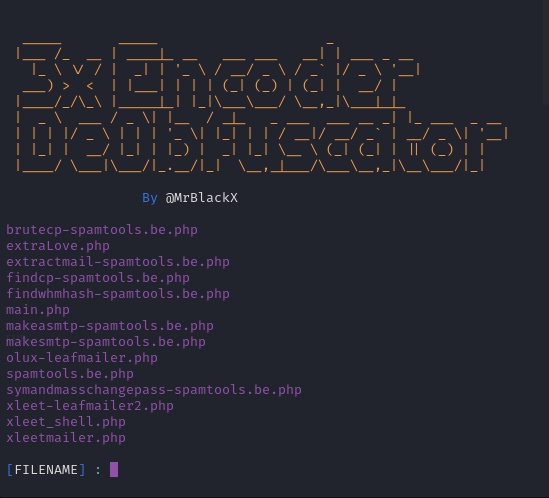
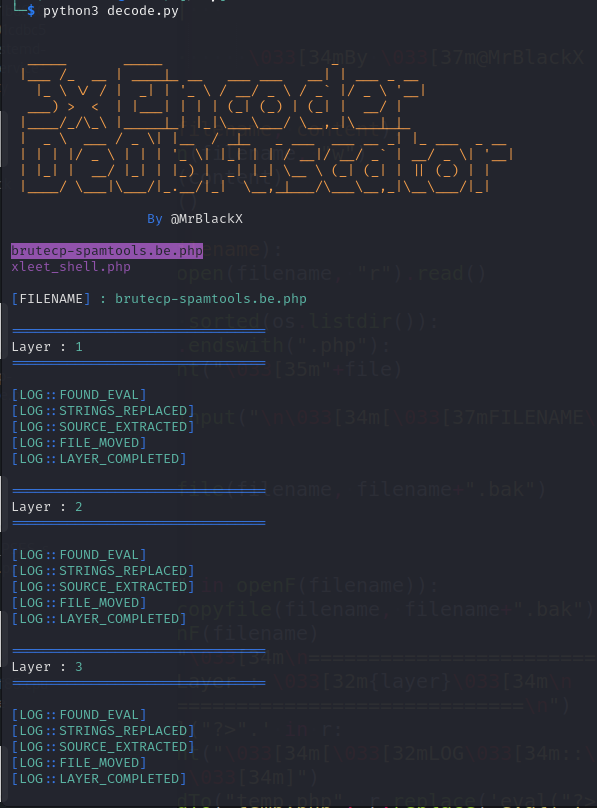

# 3xEncoder_Deobfuscator
 
### <h1 align="center" id="heading">📃 Decode 3xEncoder Scripts 📃</h1>

<p align="center">
  <br><br>
  
  
  
  
  
  <a href="https://t.me/mrblackx"></a>
  
  <a href="https://t.me/+RM6HCbeFDkWYWGBC"></a>
</p>

<h1 align=center>3xEncoder Deobfuscator</h1>

<hr>

<h2>Table Of Contents</h2>

* [General Information](#general-info)
* [Preview](#preview)
* [Installation](#installation)
* [Disclaimer](#disclaimer)
* [Credits](#credits)
* [Social Media](#social-media)
* [Bug Report](#bug-report)

<hr>

<h2>General Information</h2>
  
  This script is decoding eval's with an ending tag of PHP. 
  
  `eval('?>'.` and `eval("?>".` is been replaced to `print_r`.
  
  I'll try to make updates if i decode other scripts.
    
  <hr>
  
  An example of such a obfuscation is this :
  
  <p align="center">
  
  </p>
    
<hr>

<h2>Preview</h2>
<p align="center">
  
</p>
<p align="center">
  
</p>

<h2>Installation</h2>

  Repository requires <a href="https://www.python.org/">Python </a> v3 to run.
  
  <h3>Linux</h3>
  
  ```
  $ git clone https://github.com/rebl0x3r/3xEncoder_Deobfuscator.git
  
  $ cd URLer

  $ chmod +x decoder.py
  
  $ pip3 install colorama

  $ ./decoder.py
  ```
  Or just type :
  ```
  $ python3 decoder.py
   
  ```
 
<h3>Windows</h3>

  For windows, we need python aswell you can download it from here:<br>
  
  
  * [Python (3.9.13 | 64bit)](https://www.python.org/ftp/python/3.9.13/python-3.9.13.exe)
  * [Python (3.9.13 | 32bit)](https://www.python.org/ftp/python/3.9.13/python-3.9.13-amd64.exe)
  
   Install Python
  
   Download Script (ZIP)
  
   Extract & Go Inside Folder
  
    Press and hold <code>Shift</code> key and <code>right click</code> on the screen.
   
    Click open <code>Command Prompt</code> or <code>Windows Powershell</code> window here.
    
   Paste and run the following command:
   <code> py -m pip install colorama </code>
   <code> py decoder.py </code>
  

<h2>Disclaimer</h2>

  Use this tool for educational purposes only .🕵️‍♂️
  If you do any illegal attacks, i am not responsible for your tasks.
  Use this tool correctly, and do not re-upload it on your github repository without permissions.
  
<hr>

 Github:<br />
 
* Rebl0x3r - [https://github.com/rebl0x3r](https://github.com/rebl0x3r)
* 0n1cOn3 - [https://github.com/0n1cOn3](https://github.com/0n1cOn3)

<hr>

<h2>Bug Report</h2>

  If you found any bug or issue, please go [here](https://github.com/rebl0x3r/3xEncoder_Deobfuscator/issues)
  
  You can also request an update.
  
<hr>

